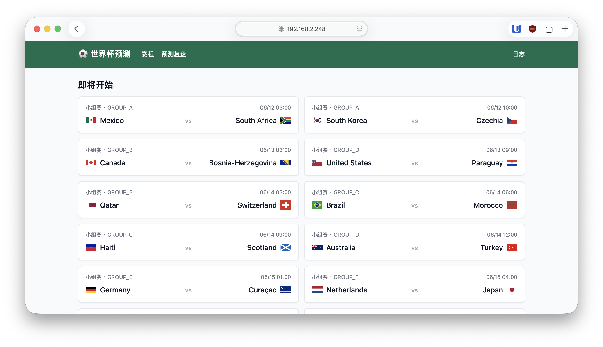

# 世界杯赛事预测

实时拉取世界杯赛程与赛果，用**可自定义的大模型**对即将开始的比赛生成赛前预测（胜/平/负概率 + 解读），并复盘预测命中率。

## 预览



> 赛程总览页：按分组展示即将开始的比赛，带队徽、开赛时间；顶部导航可进入预测复盘与运行日志。

## 技术栈

- **Next.js 15**（App Router，前后端一体，TypeScript）
- **Tailwind CSS** 样式
- **better-sqlite3** 本地存储（赛程、赛果、预测）
- **football-data.org** 免费赛事数据
- **任意 OpenAI 兼容大模型**（base URL / key / 模型名全部可配置）

## 快速开始（Debian 无桌面虚拟机）

```bash
# 1. 安装依赖
npm install

# 2. 配置环境变量
cp .env.example .env.local
# 编辑 .env.local，填入 football-data key 与大模型配置

# 3. 拉取赛程数据
npm run seed

# 4. 启动（已配置监听 0.0.0.0，可从宿主机访问）
npm run dev
```

启动后在**宿主机浏览器**访问 `http://<虚拟机IP>:3000`。
查看虚拟机 IP：`ip addr` 或 `hostname -I`。

## 环境变量

| 变量 | 说明 | 示例 |
|---|---|---|
| `FOOTBALL_DATA_API_KEY` | football-data.org 令牌 | `xxxxx` |
| `COMPETITION_CODE` | 赛事代号，世界杯为 WC | `WC` |
| `LLM_BASE_URL` | 大模型接口地址 | `https://api.openai.com/v1` |
| `LLM_API_KEY` | 大模型密钥 | `sk-xxx` |
| `LLM_MODEL` | 模型名 | `gpt-4o` / `deepseek-chat` |
| `CRON_SECRET` | 保护写接口的令牌（可选） | 随机串 |

### 切换大模型

本项目用 OpenAI 兼容协议统一接入，**切换服务商只需改三个变量**，无需改代码：

```bash
# OpenAI
LLM_BASE_URL=https://api.openai.com/v1
LLM_MODEL=gpt-4o

# DeepSeek
LLM_BASE_URL=https://api.deepseek.com/v1
LLM_MODEL=deepseek-chat

# 本地部署（vLLM / Ollama 兼容端点等）
LLM_BASE_URL=http://127.0.0.1:8000/v1
LLM_MODEL=your-local-model
```

## 接口

| 路由 | 作用 |
|---|---|
| `GET /api/sync` | 拉取赛程赛果入库（Cron 调用） |
| `GET /api/predict` | 对所有未开赛且无预测的比赛批量预测 |
| `GET /api/predict?matchId=123` | 对单场生成预测 |
| `GET /api/matches` | 返回全部比赛与预测（前端用） |

> 若设置了 `CRON_SECRET`，调用写接口需带 `Authorization: Bearer <CRON_SECRET>`。

## 页面

- `/` 赛程总览：即将开始（带预测概率条）/ 已结束（带比分）
- `/match/[id]` 单场详情：预测概率、比分、解读、命中标记
- `/review` 预测复盘：命中率统计 + 逐场对照表

## 设计要点

- **预测只在赛前生成一次并落库，不覆盖**，保证复盘公正。
- 喂给模型的是**结构化赛前数据**（两队近期战绩、历史交锋），而非凭空判断；模型输出概率与解读，并归一化概率。
- 赛前数据从已同步的历史比赛中提取，不额外消耗 API 额度。

## 在 Linux 服务器/VM 上常驻运行 + 自动更新（推荐）

项目自带一键部署脚本（systemd 常驻 + cron 定时同步预测）：

```bash
cd /opt/worldcup-predictor   # 你的项目目录
git pull                     # 拉取最新代码
sudo bash deploy/install.sh
```

脚本会自动：
1. `npm install` + `npm run build`（生产构建）
2. 注册 systemd 服务 `worldcup.service`：开机自启、崩溃自动重启、常驻 `0.0.0.0:3000`
3. 注册 cron（`/etc/cron.d/worldcup`）：每小时同步赛果、每半小时为新比赛补预测

常用命令：

```bash
systemctl status worldcup.service      # 查看运行状态
journalctl -u worldcup.service -f      # 实时日志
systemctl restart worldcup.service     # 重启（改代码 git pull + npm run build 后）
```

> 自动化靠 cron 定时调用本机 HTTP 接口（`localhost:3000/api/sync`、`/api/predict`），
> 与常驻服务同进程读写同一 SQLite，页面实时反映最新数据。
> 代码更新后需重新 `npm run build` 再 `systemctl restart`。

## 部署到 Vercel（可选）

`vercel.json` 已配置 Cron 每小时同步、每半小时补预测。
注意：Vercel serverless 文件系统只读，SQLite 落地文件不可用，部署时请改用托管数据库（Vercel Postgres / Turso）。本地与自有服务器运行不受影响。
